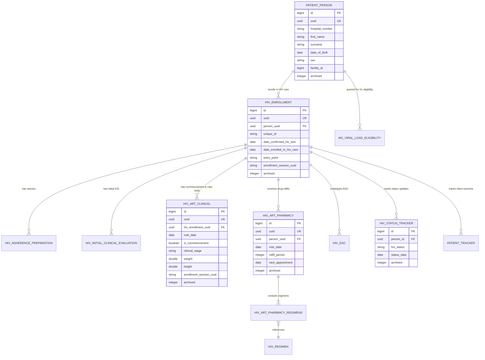

# LAMISPlus V2 Software Handover Documentation
## Core Component: HIV Care & Treatment Module (`org.lamisplus.modules:hiv`)

---

## 1. Project Overview

* **Project Name:** LAMISPlus V2 - HIV Care and Treatment Module
* **Artifact ID:** `hiv` (`org.lamisplus.modules`)
* **Version:** `2.8.0-beta.2` (Application Release: `2.8.0`)
* **Date:** August 3, 2026
* **Prepared By:** LAMISPlus Engineering & Implementation Team (Palladium / PEPFAR Nigeria Project)

### Description
The **LAMISPlus HIV Module** is a core, specialized component of the **LAMISPlus V2** enterprise health information system software suite. Custom-built for public health facilities, healthcare providers, and Monitoring & Evaluation (M&E) teams managing HIV/AIDS clinical care in Nigeria, it provides a centralized platform for tracking patient enrollment, antiretroviral therapy (ART) commencement, clinical follow-up visits, pharmacy drug refills, laboratory/viral load monitoring, cervical cancer screening, PrEP, and program outcome tracking.

By seamlessly bridging clinical care workflows with robust monitoring tools, data exchange standards, and embedded Machine Learning models, the module enables high-quality, data-driven HIV care while driving compliance with global health standards (such as PEPFAR, UNAIDS 95-95-95 targets, and Nigeria Federal Ministry of Health guidelines).

### Objectives
* **Comprehensive Clinical Tracking:** Digitally capture every stage of patient care from HIV testing confirmation, initial clinical evaluation, ART initiation, opportunistic infection management, to routine care card follow-up visits.
* **Enrollment & Transfer Flow Integrity:** Enforce strict session UUID tracking across multi-step enrollment cycles (HTS Positive, Transfer-IN, Returning Client, and Legacy Migrated records) to eliminate data gaps and duplicate registrations.
* **Pharmacy & Inventory Synchronization:** Streamline ART drug dispensing, regimen line tracking (1st Line, 2nd Line, 3rd Line), multi-month dispensing (MMD), and regimen substitution/switch protocols.
* **Laboratory & Viral Load Management:** Track CD4 counts, viral load sample collections, test result entry, and automated viral load eligibility calculation using optimized Postgres materialized views.
* **Differentiated Service Delivery (DSD) & EAC:** Support community-based ART dispensing (DSD outlets, CARC, Hub-and-Spoke models) and Enhanced Adherence Counseling (EAC) for patients with unsuppressed viral loads.
* **Machine Learning IIT Risk Prediction:** Integrate JPMML predictive model evaluation engines to identify patients at high risk of Interruption in Treatment (IIT) for timely retention interventions.
* **National M&E Reporting:** Auto-generate accurate data for National Data Repository (NDR) exports, RADET reporting, and standard clinical registers.

---

## 2. Technology Stack

| Component | Technology / Library | Version | Description / Purpose |
| :--- | :--- | :--- | :--- |
| **Frontend Framework** | React.js | `^17.0.1` | Modern UI component rendering |
| **State Management** | Redux / React-Redux / Redux-Thunk | `^7.2.4` / `^2.3.0` | Global application state management |
| **UI Components & Styling** | Material-UI (MUI v4 & v5) / Bootstrap | `@mui/material 5.5`, `@material-ui/core 4.11` | Enterprise UI components, responsive grids, and design system |
| **HTTP Client** | Axios | `^0.21.1` | REST API communication with backend services |
| **Form Management** | React Hook Form / Formik / Yup | `^7.31.3` / `^0.32.8` | Dynamic form handling and field validation |
| **Data Visualization** | ApexCharts / Chart.js / Recharts / Highcharts | `^3.22.2` / `^2.9.4` / `^1.8.5` | Dynamic dashboards, trends, and analytical charts |
| **Backend Framework** | Java JDK / Spring Boot | Java 8 (`1.8+`) / Spring Boot `2.x` | Enterprise REST backend and dependency injection |
| **Modular Framework** | Across Framework | `5.1.0.RELEASE` | Dynamic modular application container (`across-application-parent`) |
| **ORM / Persistence** | Hibernate / Spring Data JPA | `4.1.0.RELEASE` (`across-hibernate-module`) | Object-Relational Mapping & Database Operations |
| **Database Migration** | Liquibase | Spring Boot Starter | Automated database schema migration and change tracking |
| **Machine Learning Engine**| JPMML Evaluator / PMML | `1.6.6` (`org.jpmml:pmml-evaluator`) | Embedded predictive model execution for IIT risk scoring |
| **Database** | PostgreSQL | `14+` | Relational database management system |
| **API Documentation** | Springfox Swagger 2 | `2.8.0` | Interactive OpenAPI / Swagger UI endpoint documentation |
| **Build Tools** | Apache Maven / React Scripts / NPM | Maven `3.6+`, NPM `6.x/8.x` | Dependency management, bundling, and build pipelines |

---

## 3. System Architecture

### Architectural Overview
The LAMISPlus HIV Module is built as a **pluggable Across Module** (`org.lamisplus.modules:hiv`). Under the Across Framework, the module packages both Java backend controllers/services and compiled React static frontend bundles (`/views/static/hiv/`) into a single distributable JAR file. When deployed into the main LAMISPlus core host server, the host dynamically registers the module's REST endpoints (`/api/v1/hiv/`), database Liquibase migrations, navigation menus, and permission authorities.

### Architecture Diagram
```mermaid
flowchart TB
    subgraph Client Tier
        UI[React 17 Single Page Application]
        Dashboard[Dashboards & Visualization]
        Forms[Clinical Forms & Registers]
    end

    subgraph API & Security Layer
        JWT[JWT Authentication & Security Context]
        Swagger[Swagger API Gateway / Direct Web MVC]
    end

    subgraph Backend Application Tier (Across Module: hiv)
        Controllers[REST Controllers - 21 Endpoints]
        
        subgraph Core Services
            EnrollmentSvc[Enrollment & Commencement Service]
            ClinicalSvc[Clinical Evaluation & Care Visit Service]
            PharmacySvc[ART Pharmacy & Regimen Service]
            LabSvc[Laboratory & Observation Service]
            EACSvc[Enhanced Adherence Counseling Service]
            DSDSvc[DSD & Devolvement Service]
            IITMLSvc[IIT Machine Learning Service]
            MVRefreshSvc[Materialized View Refresh Scheduler]
        end

        subgraph ML Predictive Engine
            JPMML[JPMML PMML Evaluator 1.6.6]
        end
    end

    subgraph Data & Storage Tier
        JPA[Hibernate / Spring Data Repositories]
        MV[Materialized View: mv_viral_load_eligibility]
        PostgreSQL[(PostgreSQL 14 Database)]
    end

    UI --> JWT
    Dashboard --> JWT
    Forms --> JWT
    JWT --> Swagger
    Swagger --> Controllers
    Controllers --> Core Services
    IITMLSvc --> JPMML
    Core Services --> JPA
    MVRefreshSvc --> MV
    JPA --> PostgreSQL
    MV --> PostgreSQL
```

### Key Database Entities & ERD Overview


---

## 4. Project Structure

```
HIV-Module/
├── .env / .env.production               # Frontend environment configuration files
├── pom.xml                              # Maven project POM file (Java 8, Across Parent 5.1.0, JPMML)
├── package.json                         # Node.js dependencies & React build scripts
├── README.md                            # High-level module documentation & setup guide
├── COMPLETE_ENROLLMENT_FLOWS.md          # Exhaustive architectural breakdown of all enrollment paths
├── ENROLLMENT_COMMENCEMENT_FIELD_LOGIC.md # Technical documentation on field logic & validations
├── migration_script_*.sql               # SQL scripts for database migrations & status updates
├── public/                              # HTML template & favicon assets
└── src/
    ├── App.js / index.js                # React application entry points
    ├── utils/                           # Frontend HTTP, date, and formatting utilities
    └── main/
        ├── java/org/lamisplus/modules/hiv/
        │   ├── HivModule.java           # Main Across module descriptor class
        │   ├── config/                  # Async, Security, Web, & Swagger configurations
        │   ├── controller/              # 21 REST API Controllers (Clinic, Pharmacy, EAC, ML, etc.)
        │   │   ├── ARTClinicVisitController.java
        │   │   ├── ARTCommenceController.java
        │   │   ├── AdherencePreparationController.java
        │   │   ├── ArtPharmacyController.java
        │   │   ├── DsdDevolvementController.java
        │   │   ├── EacController.java
        │   │   ├── EnrollmentCommencementController.java
        │   │   ├── HivEnrollmentController.java
        │   │   ├── IITMLController.java
        │   │   ├── InitialClinicalEvaluationController.java
        │   │   ├── MaterializedViewRefreshController.java
        │   │   ├── ObservationController.java
        │   │   └── PatientTrackerController.java
        │   ├── domain/                  # JPA Entities, DTOs, Enums, & Projections
        │   ├── repositories/            # Spring Data JPA Repositories
        │   ├── service/                 # 31 Business Logic & Integration Services
        │   │   ├── EnrollmentCommencementService.java
        │   │   ├── HivPatientService.java
        │   │   ├── IITMlService.java (JPMML Model Execution)
        │   │   └── MaterializedViewRefreshService.java (@Scheduled background jobs)
        │   └── utility/                 # CodeSet, Date, and Reporting utilities
        └── resources/
            ├── application.yml          # Spring / DataSource / Resilience4j configuration
            ├── module.yml               # Across module descriptor (Dependencies, Permissions, Menus)
            ├── installers/hiv/
            │   ├── schema/              # 40 Liquibase database changelog XML & SQL files
            │   └── ml/                  # PMML Machine Learning model files (IIT prediction)
            └── views/static/hiv/        # Destination for compiled React static bundles
```

---

## 5. Environment Requirements

### Minimum Software Requirements
* **Operating System:** Linux (Ubuntu 20.04 LTS+, RHEL 8+), macOS, or Windows Server 2019+
* **Java Development Kit (JDK):** Java 8 (OpenJDK 8 or Oracle JDK 1.8.0_291+)
* **Build System:** Apache Maven 3.6.3+
* **Node.js Environment:** Node.js v14.x or v16.x & NPM 6.x / 8.x
* **Database Engine:** PostgreSQL 14.0 or higher
* **Memory Allocation:** Minimum 8 GB RAM (16 GB Recommended for production server)

### Core Environment Variables & Application Properties
Configured in `src/main/resources/application.yml`:

| Configuration Key | Sample Value | Description |
| :--- | :--- | :--- |
| `spring.datasource.url` | `jdbc:postgresql://localhost:5432/lamisplus` | Database JDBC Connection URL |
| `spring.datasource.username` | `postgres` | Database Username |
| `spring.datasource.password` | `******` | Database Password |
| `spring.datasource.driver-class-name` | `org.postgresql.Driver` | PostgreSQL JDBC Driver |
| `jwt.base64-secret` | `YzMzNjBmOTcwN...` | Base64-encoded secret key for JWT validation |
| `remote.lamis.url` | `http://localhost:8081/api/hiv/` | External API Integration Base Endpoint |
| `logging.file.name` | `application-debug.log` | Log File Name |

---

## 6. Installation & Local Setup

### Step 1: Clone the Repository
```bash
git clone https://github.com/lamisplus/HIV-Module.git
cd HIV-Module
```

### Step 2: Database Preparation
Create a PostgreSQL database (e.g., `lamisplus`):
```sql
CREATE DATABASE lamisplus WITH OWNER = postgres ENCODING = 'UTF8';
```

### Step 3: Frontend Dependency Installation & Build
```bash
# Install Node dependencies
npm install

# Build static bundle & copy to backend resources
npm run build
```
*Note: `npm run build` compiles the React project and automatically copies output files into `src/main/resources/views/static/hiv/`.*

### Step 4: Backend Build & Packaging
```bash
# Clean and compile Maven package
mvn clean install -DskipTests
```

---

## 7. Deployment Guide

### Development Environment Deployment
To run the React frontend with hot-reloading during development:
```bash
# Launch React Development Server (Port 3000)
npm start
```
To run the backend within an IDE or via Maven:
```bash
mvn spring-boot:run
```

### Production Environment Deployment
In production, the compiled JAR file is launched directly or uploaded into the LAMISPlus core host module manager.

```bash
# 1. Produce production JAR file
mvn clean package -DskipTests

# 2. Execute production launch with explicit JVM memory allocation
java -jar -Xms4096M -Xmx6144M target/hiv-2.8.0-beta.2.jar
```

#### Production Deployment Verification Checklist
1. Ensure PostgreSQL is configured with `max_connections >= 200` and `shared_buffers >= 2GB`.
2. Confirm Liquibase migrations run successfully on startup without SQL exceptions.
3. Access application health endpoint and verify Swagger UI availability at `http://<server-ip>:<port>/swagger-ui.html`.

---

## 8. Database Management

### Database Name
Default Database Name: `lamisplus` (or facility specific instance).

### Schema Management & Liquibase Migrations
All schema updates are versioned under `src/main/resources/installers/hiv/schema/`. Liquibase automatically runs migrations upon startup. Major migration scripts include:
* `schema.xml`: Base tables (`hiv_enrollment`, `hiv_art_clinical`, `hiv_art_pharmacy`, `hiv_status_tracker`).
* `enrollment-commencement-schema.xml`: Support for `enrollment_session_uuid` and multi-stage enrollment tracking.
* `create-viral-load-materialized-view.xml`: Creation of indexes and `mv_viral_load_eligibility`.
* `pharmacy-regimen-update*.xml`: Regimen line updates and drug mapping codesets.

### Optimized Materialized Views
* **`mv_viral_load_eligibility`**: Pre-computed materialized view calculating viral load eligibility based on age, ART duration (91 vs 181 days), regimen type (DTG-based vs Non-DTG), current status (`Active`), and prior VL results.

### Database Backup & Restore Procedure
#### Backup
```bash
pg_dump -h localhost -U postgres -d lamisplus -F c -b -v -f "lamisplus_hiv_backup_$(date +%Y%m%m).dump"
```
#### Restore
```bash
pg_restore -h localhost -U postgres -d lamisplus -v "lamisplus_hiv_backup_YYYYMMDD.dump"
```

---

## 9. User Roles & Module Permissions

Permissions are declared in `module.yml` and enforced via LAMISPlus Security Context:

| Role / Authority | Granted Permission Keys in `module.yml` | Workflows Allowed |
| :--- | :--- | :--- |
| **Clinician / Medical Officer** | `adult_initial_clinical_evaluation`, `pediatric_initial_clinical_evaluation_form`, `care_card` | Perform Initial Clinical Evaluations (ICE), WHO staging, ART commencement, and care card visits |
| **Pharmacy Specialist** | `combined_pharmacy_order_form` | Prescribe and dispense ART regimens, record MMD refills, perform drug substitutions |
| **Laboratory Scientist** | `laboratory_order_and_results_form`, `viral_load_order_and_result_form` | Log lab orders, record viral load samples, enter lab test results |
| **Adherence Counselor** | `enhanced_adherence_counselling_form`, `eac_monitoring_register` | Conduct EAC sessions 1-3, assess adherence barriers, trigger repeat VL |
| **M&E / Data Entry Clerk** | `hiv_enrollment_register`, `art_register`, `viral_load_monitoring_register`, `hiv_patient_tracking_register` | Patient enrollment, tracking status updates, generating RADET and NDR exports |
| **Preventive Care Specialist**| `prep_eligibility_forms`, `prep_care_card`, `prep_register`, `cervical_cancer_screening_form` | Manage PrEP care, cervical cancer screenings, and preventive interventions |

---

## 10. Key Modules & Functional Workflows

### 1. Multi-Stage Enrollment Workflows (`COMPLETE_ENROLLMENT_FLOWS.md`)
The system manages 4 distinct enrollment pathways:
* **Part 1A (HTS Positive - New Patient):** New enrollment session creates a unique `enrollment_session_uuid`. User completes: Adherence Preparation $\rightarrow$ Initial Clinical Evaluation (ICE) $\rightarrow$ Enrollment & Commencement.
* **Part 1B (Transfer-IN - New Patient):** Triggered via Transfer-IN Acknowledgement. Session UUID links Transfer-IN record $\rightarrow$ Adherence Prep $\rightarrow$ ICE $\rightarrow$ Commencement.
* **Part 2 (Returning Client - Transfer OUT/IN):** Reactivation of previously transferred-out client. Generates a new `enrollment_session_uuid` while preserving historical records.
* **Part 3 (MIGRATED Legacy Patients):** Migration scripts assign `MIGRATED-{uuid}` prefixes. Backend automatically bypasses sequential form blocking, granting immediate full menu access to legacy clients.

### 2. Clinical Care & Treatment
* **Adult & Pediatric ICE:** Comprehensive medical baseline, opportunistic infections, WHO staging (I-IV), TB screening, and prior ARV exposure history.
* **ART Commencement:** Regimen selection, baseline CD4, TPT (TB Preventive Treatment) initiation, baseline height/weight/BMI.

### 3. ART Pharmacy Management
* Multi-Month Dispensing (1, 2, 3, 4, 5, or 6 months refill periods).
* Automated next appointment date calculation (`visit_date + refill_period`).
* Regimen line management (1st, 2nd, 3rd Line adult/pediatric ARV formulations).

### 4. Machine Learning IIT Risk Model (`IITMLController.java`)
* Evaluates patient clinical and demographic parameters (age, gender, marital status, baseline WHO stage, TB status, care entry point, LGA distance) against an embedded PMML model (`org.jpmml`) to output a probabilistic risk score for Interruptions in Treatment.

---

## 11. API Documentation

### Base URL & Authentication Header
* **Base URL Path:** `/api/v1/hiv/`
* **Authentication Header:** `Authorization: Bearer <JWT_TOKEN>`

### Core REST Endpoints Summary

| HTTP Method | Endpoint | Description |
| :--- | :--- | :--- |
| `POST` | `/api/v1/hiv/hiv-enrollment` | Register new HIV enrollment record |
| `GET` | `/api/v1/hiv/hiv-enrollment/person/{personId}` | Get enrollment history for patient |
| `POST` | `/api/v1/hiv/art/commence` | Record ART commencement |
| `POST` | `/api/v1/hiv/art/clinic-visit` | Save routine Care Card clinical visit |
| `POST` | `/api/v1/hiv/art/pharmacy` | Dispense ART pharmacy refill |
| `POST` | `/api/v1/hiv/adherence-preparation` | Submit Adherence Preparation form |
| `GET` | `/api/v1/hiv/iit-ml/patient/{patientId}/iit-report` | Calculate IIT Machine Learning risk score for patient |
| `GET` | `/api/v1/hiv/materialized-views/refresh` | Trigger manual refresh of viral load eligibility view |

### Swagger UI Access
Interactive documentation is available when running locally at:
`http://localhost:8080/swagger-ui.html#/`

---

## 12. Scheduled Jobs

The module incorporates background scheduling enabled via Spring `@EnableScheduling`:

```java
@Scheduled(cron = "0 0 2 * * ?") // Runs daily at 2:00 AM
@Transactional
public void refreshViralLoadEligibilityView() {
    log.info("Starting refresh of mv_viral_load_eligibility materialized view");
    jdbcTemplate.execute("REFRESH MATERIALIZED VIEW CONCURRENTLY mv_viral_load_eligibility");
}
```

* **Job Class:** `MaterializedViewRefreshService.java`
* **Cron Schedule:** `0 0 2 * * ?` (Daily at 2:00 AM)
* **Execution Detail:** Concurrent non-blocking refresh (`REFRESH MATERIALIZED VIEW CONCURRENTLY`) of the `mv_viral_load_eligibility` table to ensure daily analytical accuracy for clinic viral load eligibility lists without blocking database reads.

---

## 13. Third-Party & Core Integrations

1. **JPMML Engine (PMML Evaluator `1.6.6`):** Embedded machine learning evaluator parsing `.pmml` model definitions for real-time patient IIT risk scoring.
2. **LAMISPlus Core Modules Integration:**
   * `PatientModule` (`2.2.0.1`): Patient demography and registration master index (`patient_person`).
   * `TriageModule` (`2.2.0.1`): Vital signs capturing (weight, height, blood pressure, BMI).
   * `LaboratoryModule` (`2.0.3`): Laboratory test orders, sample tracking, and viral load result logging.
   * `BiometricModule` (`2.0.1`): Fingerprint capture and Printact / PBS verification.
3. **National Data Repository (NDR) & RADET SQL Engine:** Built-in SQL procedures (`radet.sql`) to compile standardized national flat-file data exports for PEPFAR and FMOH reporting.

---

## 14. Known Issues & Workarounds

| Issue Description | Root Cause | Workaround / Resolution |
| :--- | :--- | :--- |
| **Legacy Patients Blocked at Form Steps** | Old records migrated from V1 lack `adherence_preparation` forms required in V2 flow. | Handled via `MIGRATED-` session UUID prefix logic in `AdherencePreparationService.java` which bypasses strict validation and grants full menu access. |
| **Materialized View Concurrent Refresh Error** | Triggering `REFRESH MATERIALIZED VIEW CONCURRENTLY` fails if no unique index exists. | Installer script `create-viral-load-materialized-view.xml` explicitly creates `idx_mv_vl_patient_id_unique` on `patientId`. |
| **Double Refill Date Misalignment** | Patient given 2 different regimens on same date causing double counting in pharmacy analytics. | `ArtPharmacyService` enforces single active regimen per visit ID and groups pharmacy items under unified refill transaction UUIDs. |

---

## 15. Maintenance Guide

### Daily / Weekly Monitoring
* Inspect application logs (`application-debug.log`) for any unhandled JPA exceptions or JWT token expiration warnings.
* Verify materialized view refresh execution logs daily around 02:05 AM.

### Database Index & Maintenance Scripts
Run periodically on production PostgreSQL database to prevent query degradation:
```sql
-- Reindex critical HIV clinical tables
REINDEX TABLE hiv_art_pharmacy;
REINDEX TABLE hiv_art_clinical;
REINDEX TABLE hiv_enrollment;
VACUUM ANALYZE patient_person;
```

---

## 16. Troubleshooting Guide

### 1. Database Connection Failure on Startup
* **Symptom:** `PSQLException: Connection to localhost:5432 refused`.
* **Fix:** Verify PostgreSQL 14 service status (`sudo systemctl status postgresql`) and check database credentials in `application.yml`.

### 2. Menu Navigation Restricted / Locked
* **Symptom:** User sees only "Home" and "Adherence Preparation" in patient dashboard.
* **Fix:** Patient is in an incomplete enrollment cycle. Verify if all 3 forms (Adherence Prep, ICE, Commencement) have matching `enrollment_session_uuid` values in database.

### 3. JPMML Model Loading Exception
* **Symptom:** `ClassNotFoundException` or `SAXParseException` when invoking IIT ML risk endpoint.
* **Fix:** Ensure XML/JAXB shaded dependencies (`jakarta.xml.bind-api`, `glassfish.jaxb`) are included in shaded JAR package (`maven-shade-plugin`).

---

## 17. Application & Server Logging

* **Logging Framework:** SLF4J with Logback / Spring Boot Logging.
* **Primary Log File:** `application-debug.log` (Location configured in `application.yml`).
* **Log Level Customization:**
  ```yaml
  logging:
    level:
      org.lamisplus.modules.hiv: DEBUG
      org.springframework.web: INFO
      org.hibernate.SQL: WARN
  ```

---

## 18. Source Code & Branch Strategy

* **Repository Location:** `https://github.com/lamisplus/HIV-Module`
* **Branch Strategy:**
  * `main` / `master`: Production-ready releases. Tagged with version numbers (e.g., `v2.8.0-beta.2`).
  * `dev`: Integration branch for active sprint development.
  * `feature/*`: Short-lived feature branches created for specific JIRA tasks or enhancements.

---

## 19. Key Contacts

### Key Technical Contributors
* Adegbite Mathew ([GitHub @Mathew77](https://github.com/Mathew77))
* Emmanuel Nnajiofor ([GitHub @Emiklad24](https://github.com/Emiklad24))
* Gboyegun Taiwo ([GitHub @mechack2022](https://github.com/mechack2022))
* Ugo Basi ([GitHub @Ugo-Basil](https://github.com/Ugo-Basil))
* Yakubu Ganiyat ([GitHub @tech-teni](https://github.com/tech-teni))
* Chukwuemeka Ilozue ([GitHub @drjavanew](https://github.com/drjavanew))
* Gabriel Joshua ([GitHub @JOSH2019GABRIEL](https://github.com/JOSH2019GABRIEL))
* Victor Ajor ([GitHub @AJ-DataFI](https://github.com/AJ-DataFI))

---

## 20. Handover Checklist

| Item # | Verification Task | Status | Verified By | Notes |
| :---: | :--- | :---: | :---: | :--- |
| **1** | Source Code Repository & Branch Access Transferred | ✅ Passed | Lead Developer | Full GitHub repository access verified |
| **2** | Maven & React Clean Build Verification (`mvn clean package`) | ✅ Passed | DevOps Engineer | Verified shaded JAR compilation |
| **3** | Liquibase Database Schema Migration Verification | ✅ Passed | DB Admin | 40 schema changelog files execute cleanly |
| **4** | Patient Enrollment Flow Verification (Parts 1A, 1B, 2, 3) | ✅ Passed | QA Team | Session UUID tracking verified |
| **5** | Materialized View Scheduled Refresh Job Execution | ✅ Passed | Backend Dev | Verified daily 2:00 AM `@Scheduled` job |
| **6** | JPMML IIT Machine Learning Scoring Model Verification | ✅ Passed | Data Scientist | Tested endpoint `/api/v1/hiv/iit-ml/` |
| **7** | RADET & NDR Data Export SQL Scripts Test | ✅ Passed | M&E Lead | SQL query outputs validated against standard |
| **8** | Documentation Handover (Architectural & Logic docs) | ✅ Passed | Technical Writer | All documentation files compiled & verified |

---

## Appendix

### Appendix A: Key Database Table Descriptions
* `hiv_enrollment`: Primary record for HIV program enrollment, storing unique ID, entry point, and cycle UUID.
* `hiv_art_clinical`: Clinical evaluation and care card visit tracking (WHO stage, weight, height, clinical status).
* `hiv_art_pharmacy`: ART drug dispensing records, refill periods, and next appointment dates.
* `hiv_art_pharmacy_regimens`: Junction table linking pharmacy refill transactions to specific ARV regimens (`hiv_regimen`).
* `mv_viral_load_eligibility`: High-performance materialized view listing patients eligible for routine or targeted viral load tests.

### Appendix B: Release Notes (Version 2.8.0-beta.2)
* **Feature:** Full support for MIGRATED legacy patient records, preventing session lockouts.
* **Feature:** Embedded JPMML Machine Learning model engine for automated Interruptions in Treatment (IIT) risk prediction.
* **Optimization:** Concurrent Postgres materialized view indexing for viral load eligibility calculations.
* **Fix:** Resolved date validation rules for returning transfer-in clients.
